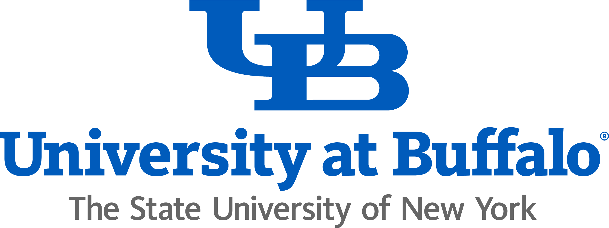

# Production and Operations Management (MGO 302)

## 📑 Table of Contents
- [Production and Operations Management (MGO 302)](#production-and-operations-management-mgo-302)
  - [📑 Table of Contents](#-table-of-contents)
  - [👨‍🏫 Instructor](#-instructor)
  - [🧑‍🏫 Student Assistant](#-student-assistant)
  - [📌 Logistics](#-logistics)
  - [📚 About the Course](#-about-the-course)
  - [📘 Textbook](#-textbook)
  - [📘 Prerequisite or Co-requisite](#-prerequisite-or-co-requisite)
  - [💻 Course Technology](#-course-technology)
    - [UB Learns](#ub-learns)
    - [Zoom](#zoom)
    - [Generative AI](#generative-ai)
    - [📢 Student Responsibilities](#-student-responsibilities)
  - [🧾 Academic Integrity](#-academic-integrity)
  - [⚠️ Course Materials Policy](#️-course-materials-policy)
  - [🌍 Diversity and Inclusion](#-diversity-and-inclusion)
  - [🏛️ Campus Resources](#️-campus-resources)
  - [📊 Grading Components](#-grading-components)
  - [📅 Course Schedule](#-course-schedule)
  - [| 16   | Dec 08 – Dec 12      | **Final exam review, and final exam (covers weeks 1–15)** | —              |](#-16----dec-08--dec-12-------final-exam-review-and-final-exam-covers-weeks-115----------------)
  - [⚠️ Exam Dates – Please Read Carefully](#️-exam-dates--please-read-carefully)

## 👨‍🏫 Instructor
**Parshan Pakiman**  
Assistant Professor of Operations Management  
Department of Operations Management and Strategy  
University at Buffalo School of Management  
- 📍 Office Location: 343 Jacobs Management Center ([UB map](https://www.buffalo.edu/home/visiting-ub/map.html#JACOBS))
- 📧 Email: [ParshanP@Buffalo.edu](mailto:parshanp@buffalo.edu)  
- 🌐 Web: [ParshanPakiman.Github.io](https://parshanpakiman.github.io/)  
- 🕒 Office Hours: Fridays, 2:00 PM – 3:00 PM, or by appointment  
  - 🔗 Virtual: [https://buffalo.zoom.us/my/pakiman.office.hours](https://buffalo.zoom.us/my/pakiman.office.hours)  
  - 🏢 In-Person: 343 Jacobs Management Center

## 🧑‍🏫 Student Assistant
**Mingyuan Yuan**  
Doctoral Student, Operations Management and Strategy  
- 📍 Office Location: 326H Jacobs Management Center ([UB map](https://www.buffalo.edu/home/visiting-ub/map.html#JACOBS))
- 📧 Email: [myuan2@buffalo.edu](mailto:myuan2@buffalo.edu)
- 🕒 Office Hours: Wedensday, 5:00 PM – 6:00 PM, or by appointment

## 📌 Logistics
- 🗓️ **Semester**: Fall 2025 ([UB calendar](https://www.buffalo.edu/registrar/calendars/current-academic-calendar.html))
- 🎯 **Level**: Undergraduate  
- 📍 **Class Location**: Clemens Hall, Room 120 ([UB map](https://www.buffalo.edu/home/visiting-ub/map.html#CLEMEN))
- 🕒 **Class Time**: 
  - **Section 23235:** Monday, Wednesday, Friday from <u>11:00AM to 11:50AM</u>
  - **Section 21536:** Monday, Wednesday, Friday from <u>12:00PM to 12:50PM</u>
- 🏫 **Course Mode**: In-person

## 📚 About the Course

This course provides an introduction to the fundamental concepts, tools, and strategies in operations management, 
focusing on how organizations design, manage, and improve their processes to match supply with demand. 
Students will begin by learning how to model and analyze processes, evaluate capacity, and address variability and queueing effects. 
The course then builds toward inventory management under both deterministic and uncertain demand, 
incorporating models such as EOQ, newsvendor, and order-up-to. 
After the midterm, students will explore forecasting techniques, risk pooling, and revenue management, 
followed by supply chain fundamentals, coordination mechanisms, and performance drivers. 
The final weeks focus on quality management, lean operations, and project management, equipping students with
a broad set of analytical and managerial skills to diagnose operational challenges and implement effective solutions.
By the end of the semester, students will be able to:
- Understand foundational principles of operations and supply chain management  
- Apply analytical tools to improve business processes  
- Evaluate trade-offs in operational decision-making  
- Communicate managerial insights

## 📘 Textbook
**Main Reference**  
- Cachon, Gérard, and Christian Terwiesch. *Matching Supply with Demand: An Introduction to Operations Management*. 5th ed., McGraw Hill, 2023.

**Supporting References**  
- Simpson, Natalie C., and Philip G. Hancock. *Practical Operations Management*. 2nd ed., Hercher Publishing, 2017.  
- Reid, R. Dan, and Nada R. Sanders. *Operations Management: An Integrated Approach*. 4th ed., John Wiley & Sons, 2019.

**Notes:**
- Amazon and other vendors offer multiple editions and rental options, including paperback versions that may be more affordable.  
- You are encouraged to choose the most cost-effective version that covers the required content.  
- Additional articles, cases, or readings may be assigned depending on the topic. These will be announced as needed throughout the course.

## 📘 Prerequisite or Co-requisite
- **Prerequisite:** MGQ 201  
- **Co-requisite:** Completion of or concurrent enrollment in MGG 102 or MGG 150  

## 💻 Course Technology

### UB Learns
- The primary platform for this course is [UB Learns](http://ublearns.buffalo.edu/), which will serve as the central hub for course content, announcements, and grading.  
- Please familiarize yourself with UB Learns. You can explore its features and guides at [UB Learns Student Guide](https://www.buffalo.edu/lms/guides-students.html#title_0_copy:~:text=Quick%20Start%20Videos-,Available%20Guides,-Basics%20of%20UB)

### Zoom
- I will hold office hours both in person and online. If you prefer to attend online or schedule a virtual meeting with me, we will use Zoom. 
- Please log into your [UB Zoom](https://www.buffalo.edu/ubit/services/zoom.html) account before joining. You can access my scheduled Zoom meeting at https://buffalo.zoom.us/my/pakiman.office.hours.

### Generative AI
Generative AI tools (e.g., ChatGPT, Claude, Gemini) can support your learning, but they must be used **ethically and responsibly**. 

✅ **Permitted Uses**  
- Clarifying course concepts or terminology.  
- Brainstorming ideas, examples, or alternative approaches.  
- Practicing with additional problems or quizzes generated by AI.  
- Improving clarity, grammar, or formatting of your own writing.  

🚫 **Not Permitted**  
- Using AI to complete homework, quizzes, or exams.  
- Submitting any AI output as your own original work.  
- Using AI to generate code, formulas, or problem solutions you do not fully understand.  

⚠️ **Required Practice**  
- **Attempt first:** Always create your own draft or solution before using AI.  
- **Ask specifically:** Use AI to answer targeted questions or explain concepts, not to “do the work.”  
- **Acknowledge use:** Whenever you use an AI tool, include a brief *AI Use Statement* in your submission.  
  For example:  
  > I used ChatGPT to clarify the definition of the EOQ formula.  
- **Verification:** The instructor and student assistant may use AI-detection tools to help determine whether submitted work is AI-generated or written by the student. Misrepresenting AI-generated work as your own is considered academic fraud. Read more at the [UB Academic Integrity – Artificial Intelligence](https://www.buffalo.edu/academic-integrity/about/artificial-intelligence.html) page.

### 📢 Student Responsibilities

1. Ensure you have access to **UB Learns** and **Zoom** from the very beginning of the semester. Log in and familiarize yourself with both platforms as soon as possible.  
2. Check **UB Learns** and your **UB email** regularly for course updates and announcements.  
3. Stay current with class lectures — this is key to earning a good grade.
4. All material covered in lectures is also included in your assigned readings. Your textbook remains your most reliable reference and should always be accessible.  
5. 🚫 Eating or drinking is not permitted during class sessions.  
6. 📧 All email communications must include **"MGO-302"** in the subject line to ensure a timely response.

## 🧾 Academic Integrity
- Academic integrity is essential to your learning and to UB’s academic standards.  
- You are expected to complete all work honestly and independently.  
- **There is no group submission in MGO 302.**  
- Misrepresenting someone else’s work as your own is academic fraud.  
- Refer to the [UB Undergraduate Handbook](http://mgt.buffalo.edu/programs/undergrad/handbooks/handbook) for detailed policies.

## ⚠️ Course Materials Policy
- Do not share, upload, reproduce, or distribute materials without written permission.  
- Violations may result in disciplinary action under UB’s Academic Integrity Policy and Code of Conduct.

## 🌍 Diversity and Inclusion
- Maintain professionalism and respect in all interactions.  
- Discriminatory language or behavior is not tolerated.  
- Respect UB’s diverse learning community.  
- Learn more: [UB Inclusive Excellence Resources](http://www.buffalo.edu/inclusion/resources/IXResources.html)

## 🏛️ Campus Resources
- Your well-being is vital—please reach out if you need support.  
- I’m also available if you need help navigating resources.  
- ♿ **Accessibility**: Contact the Office of Accessibility Resources (60 Capen Hall, 716-645-2608). [More Info](http://www.buffalo.edu/studentlife/who-we-are/departments/accessibility.html)  
- 🔐 **Sexual Violence Support**: Title IX (716-645-2266), Confidential Advocate (716-796-4399)  
- 🧠 **Mental Health**: Counseling (716-645-2720), Health Services (716-829-3316), Health Promotion (716-645-2837)

## 📊 Grading Components

1. **Participation (5%)**  
   Participation goes beyond attending class: it means actively engaging in discussions, asking thoughtful questions, and contributing to group activities. Grades will be based on the quality and consistency of your contributions.  
   - Regular attendance and engagement provide the best chance to earn full credit.  
   - Frequent absences will reduce your score.

2. **Quizzes (20%)**  
   There will be seven in-class quizzes.  
   - Each quiz will be administered during **the first 15 minutes of class**. Late arrivals will have reduced time; no extra time will be given.  
   - Your top five scores out of the seven quizzes will count toward the 20% quiz portion of your final grade, with each of these five quizzes accounting for 4%.
   - Quizzes will cover only the most recently taught material.  
  
3. **Homeworks (25%)**  
   - There will be five homework assignments, each worth 5% of your final grade.  
   - Submit via **UB Learns** by **11:00 PM** on the due date in **PDF format**.  
   - Late submissions incur a **20% penalty** for that assignment.
   - Work submitted more than **48 hours** after the deadline will receive **a zero**.
   - Extensions, granted only in rare cases, will not exceed **48 hours**.

4. **Midterm Exam (20%)**  
   - Covers the first half of the course; may include multiple-choice, problem-solving, and short written responses.
   - Midterm exam date and time: **Friday, October 17, 2025**, from **11:00 AM to 12:50 PM** in **Clemens Hall, Room 120**.

5. **Final Exam (30%)**  
   - Comprehensive, with emphasis on the second half; may include multiple-choice, short-answer, and short written responses.
   - Final exam date and time: **Wednesday, December 10, 2025**, from **11:45 AM to 2:45 PM** in **Clemens Hall, Room 120**

> ⚠️ **Make-up exam** will only be granted for documented medical emergencies or unavoidable circumstances.

## 📅 Course Schedule
| Week | Dates (Mon–Fri)      | Topic                                                     | Chapter(s)     |
|------|----------------------|-----------------------------------------------------------|----------------|
| 1    | Aug 25 – Aug 29      | Introduction & Process View of Operations                | 1, 2           |
| 2    | Sep 01 – Sep 05      | Process Analysis & Balancing                             | 3, 4           |
| 3    | Sep 08 – Sep 12      | Variability in Processes                                 | 9.1–9.5        |
| 4    | Sep 15 – Sep 19      | Queueing Fundamentals                                    | 9.6–9.10, 11   |
| 5    | Sep 22 – Sep 26      | Managing Flow Interruptions & EOQ                        | 5              |
| 6    | Sep 29 – Oct 03      | Inventory under Uncertain Demand (Newsvendor Model)      | 14             |
| 7    | Oct 06 – Oct 10      | Multi-Period Inventory Systems (Order-up-to Model)       | 16             |
| 8    | Oct 13 – Oct 17      | **Fall break, midterm review, and midterm exam (covers weeks 1–7)** | —    |
| 9    | Oct 20 – Oct 24      | Forecasting                                              | 13             |
| 10   | Oct 27 – Oct 31      | Risk Pooling                                             | 17             |
| 11   | Nov 03 – Nov 07      | Revenue Management Fundamentals                          | 18.1–18.4      |
| 12   | Nov 10 – Nov 14      | Supply Chain Fundamentals                                | 15, 19         |
| 13   | Nov 17 – Nov 21      | Supply Chain Coordination                                | 19             |
| 14   | Nov 24 – Nov 28      | Quality Management                                       | 7              |
| 15   | Dec 01 – Dec 05      | Lean Operations                                          | 8              |
| 16   | Dec 08 – Dec 12      | **Final exam review, and final exam (covers weeks 1–15)** | —              |
---

## ⚠️ Exam Dates – Please Read Carefully

- The **midterm exam** for both sections of **MGO 302** is **tentatively scheduled** for **Friday, October 17, 2025**, from **11:00 AM to 12:50 PM** in **Clemens Hall, Room 120**. Any concerns or scheduling conflicts must be reported to the instructor at **parshanp@buffalo.edu** **immediately**.  
- The **final exam** for both sections of **MGO 302** is scheduled by UB for **Wednesday, December 10, 2025**, from **11:45 AM to 2:45 PM** in **Clemens Hall, Room 120**. Please plan your travel and other commitments accordingly.

---
**Note:** The instructor gratefully acknowledges the guidance and resources provided by faculty across UB, UChicago, and UIC in preparing this course.

